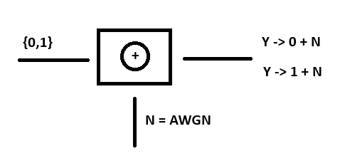
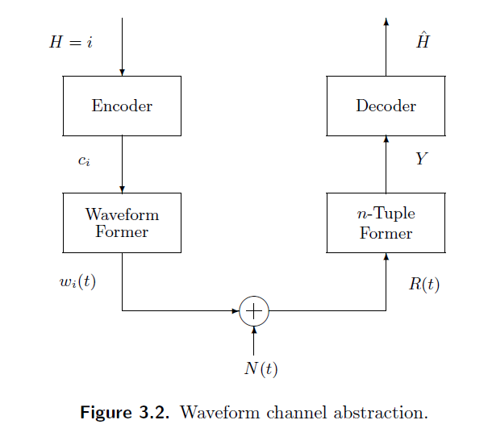

# Cuarta Clase 27/3



$P_{H|Y}(i|y) = \frac{f_{Y|H}(y|i)\cdot P_{H}(i)}{f_Y(y)}$

donde $\hat{H} = i$

$P(A|B) = \frac{P(A) \cdot P(B|A)}{P(B)} = \frac{P(AB)}{P(B)}$

$\hat{H}(y) = \underset{i\in \mathcal{H}}{\argmax} P_{H|Y}(i|y) \rightarrow$ MAP

Hipotesis Equiprobable $\hat{H}(y) = \underset{H\in (0,1)}{\argmax} f(y|H) \rightarrow$ ML

**MAP** = cuando se conoce la probabilidad de la fuente.

**ML** = cuando no se conoce la distribucion de la fuente y/o cuando es equiprobable; solo se necesita la funcion de distribucion condicionada.

Regla de Decision:

**ML:** $P_{Y|H}(y|1)\overset{\hat{H}=1}{\underset{\hat{H}=0}\gtreqless}P_{Y|H}(y|0)$

**MAP:** $P_H(1) \cdot P_{Y|H}(y|1)\overset{\hat{H}=1}{\underset{\hat{H}=0}\gtreqless}P_H(0) \cdot P_{Y|H}(y|0)$

Likehood Ratio = $Λ(y) = \frac{f_{Y|H}(y|1)}{f_{Y|H}(y|0)}\overset{\hat{H}=1}{\underset{\hat{H}=0}\gtreqless} \frac{P_H(0)}{P_H(1)}=\eta$

(NOTA: "si $\eta = 1$ se trata de una señal de fuente equiprobable, por ende de una regla de decisión ML).

**Testeo de hipotesis m-ario**:

$\hat{H}_{MAP}(y)=\underset{i \in \mathcal{H}}{\operatorname{argmax}}f_{Y|H}(y|i)P_{H}(i)$

**Hipotesis binaria (2 gaussianas con media en 0 y en 1)**:

El error es la integral desde 0,5 (valor critico) al resto de la cola de la distribucion:

$\int_{-\infin}^{0.5}f(y|H=1)dy = \int_{0.5}^{\infin}f(y|H=0)dy$

para calcular el error necesitamos el area desde el valor critico multiplicada por la probabilidad de la fuente:



**La funcion Q**:

se utiliza para calcular el area de una Gaussiana desde un valor x al infinito


Variable aleatoria Gaussiana: $\mathcal{N}(media,varianza^2) = \mathcal{N}(\mu,\sigma^2)$

Probabilidad de Error utilizando la Funcion Q:

$P_e(Z\geqslant\theta)=Q(\frac{\theta-m}{\sigma})$

siendo:

- $\theta$ = Threshold o valor a valuar y
- $m$ = media de la observación de distribucion normal
- $\sigma$ = varianza de la observacion distribución normal

NOTA: $Q(0) = \frac{1}{2}; Q(-\infin) = 1; Q(\infin) = 0$

Codigo de la funcion Q:

```python
import numpy as np
from scipy import special

def Q_function(x):
    return 0.5 * (1 - special.erf(x/np.sqrt(2)))
```
