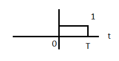

# Septima Clase 17/04

$H = i; Y = c_i + Z$

donde $Z \sim N(0,\frac{N_0}{2}I_n)$

## Ejemplo 3.7

Las siguientes 4 elecciones de $W = \{w_o(t),w_1(t)\}$ comparten el mimmo codigo $C = \{c_0,c_1\}$ con $c_0 = (\sqrt{\epsilon},0)^T$ y $c_0 = (0,\sqrt{\varepsilon})^T$

### *Elección 1*

$w_0(t) = \sqrt{\frac{\varepsilon}{T}} \quad \mathbb{1} \{t \in [0,T]\}$

$w_1(t) = \sqrt{\frac{\varepsilon}{T}}\quad \mathbb{1} \{t \in [T,2T]\}$

$\psi_1(t) = \frac{1}{\sqrt{T}}$

### *Elección 2: (Frequency Shift Keying [FSK])*

$w_0(t) = \sqrt{\frac{2\varepsilon}{T}}\sin(\pi k\frac{t}{T}) \quad \mathbb1\{t \in [0,T]\}$

$w_1(t) = \sqrt{\frac{2\varepsilon}{T}}\sin(\pi l\frac{t}{T}) \quad \mathbb1\{t \in [0,T]\}$

$w_0(t) = \sqrt{\varepsilon} \cdot \psi_0(t)$

$w_1(t) = \sqrt{\varepsilon} \cdot \psi_1(t)$

>En todas estas configuraciones la probabilidad de error es la misma.

### *Elección 3: (Sinc pulse position modulation)*

$w_0(t) = \sqrt{\frac{\varepsilon}{T}} \operatorname{sinc}(\frac{t}{T})$

$\operatorname{sinc}(t/T) = 0 \rightarrow t/T = \pi k t/T$

$w_1(t) = \sqrt{\frac{\varepsilon}{T}} \operatorname{sinc}(\frac{t-T}{T})$

### *Elección 4: (Spread spectrum)*

$w_0(t) = \sqrt{\varepsilon}\cdot\psi_1(t)\rightarrow$ con $\psi_1(t) = \sqrt{\frac{1}{T}}\sum_{j=1}^{n}s_{0,j} \quad\mathbb{1}\{t-j\frac{T}{n} \in [0,\frac{T}{n}]\}$

$w_1(t) = \sqrt{\varepsilon}\cdot\psi_2(t) \rightarrow$ con $\psi_1(t) = \sqrt{\frac{1}{T}}\sum_{j=1}^{n}s_{1,j} \quad\mathbb{1}\{t-j\frac{T}{n} \in [0,\frac{T}{n}]\}$

donde s son codigos de expansión ortogonales. $s_0,s_1,...$ modifican la altura de los cuadrados.

$P_e(\frac{||c_1-c_0||}{2\sigma})$

## Ejemplo 3.9

### PSK (QPSK)

donde:

## Generalización y estructuras alternativas de receptor

$Y = (Y_1,Y_2,...,Y_n)^T$ donde

$Y_i = \lang R,\psi_i\rang$, $i = 1,...,n$.

$f_{Y|H}(y|i) = \frac 1{(2\pi\sigma^2)^{\frac{n}{2}}}\exp{(-\frac{{||y-c_i||}^2}{2\sigma^2})}$

MAP: $\underset{i}\argmax P_H(i)\cdot f_{Y|H}(y|i)$

$\underset{i}{\operatorname{argmax}}[\ln P_H(i)+ -\frac{{||y-c_i||}^2}{2\sigma^2}]$

$\operatorname{min}[{\|y-c_i\|}^2 - \ln P_H(i)]$

$\lang y,c_i \rang = \sum y_i \cdot c_{i,j} = \underset{j}\sum \int r(t) \cdot \psi_j(t) \cdot c_{i,j} dt = \int r(t) \sum c_{i,j} \psi_j(t) dt =$

{\|y-c_0\|}^2 - N_0\cdot Ln P_H(0) \underset{H = 0}\overset{H = 1} Corregir

>Las señales son ortogonales, las bases son ortonormales y las palabras codigo son ortogonales.
