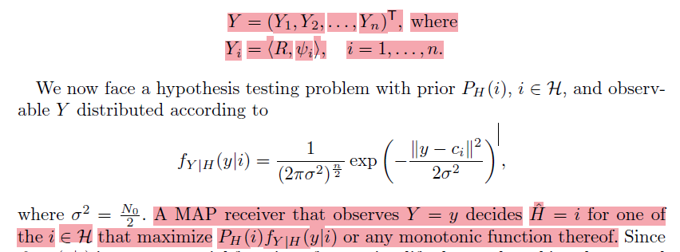
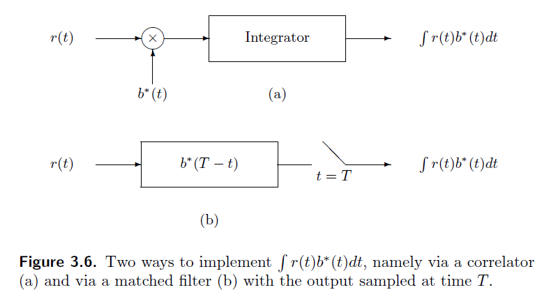
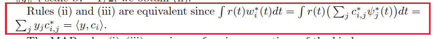
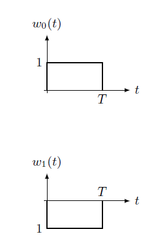
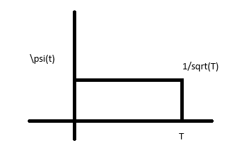
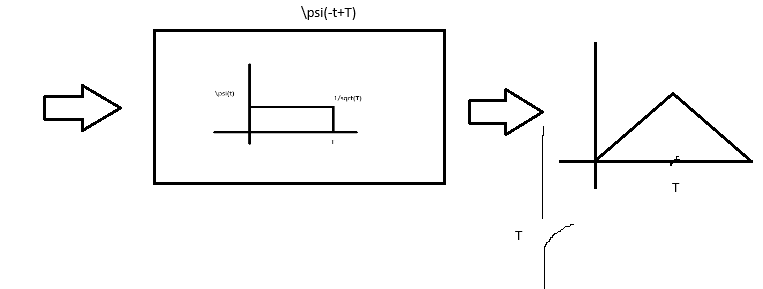

# Octava Clase 24/04



Para este caso la matriz de covarianza esta implicita, se supone su valor de la diagonal $\sigma^2=\frac{N_0}{2}$. Si no fuera este el caso aparecerian otros terminos dentro de la ecuacion.

## Norma MAP

### I

$$\underset{i}\argmax{P_H(i)\cdot f_{Y|H}(y|i)} \\ \underset{i}\argmax{[\ln P_H(i)+(-\frac{\|y-c_i\|^2}{2\sigma^2})]} \\ \underset{i}\argmin{[\|y-c_i\|^2-\ln{f_H(i)\cdot2\sigma^2}]}$$

### II

$y\nearrow\downarrow Z = y - c_i\\\longrightarrow\\c_i$

$Z = \{Z_1,Z_2,...,Z_n\}$ Ruido

$Z_i=\langle N,\sigma_i \rangle$

$\|a\|^2 = \langle a,a \rangle$

$\langle a,b \rangle = a \cdot b = \|a\| \|b\| \cos(\angle{ab})$

$\|a-b\|^2 = \langle a-b,a-b \rangle = \langle a-b,a \rangle -\langle a-b,b\rangle = \langle a,a \rangle - \langle b,a \rangle - \langle a,b \rangle + \langle b,b \rangle$

Norma de una señal integrada entre a y b: $\|\alpha(t)\| = \sqrt{\int_a^b|\alpha(t)|^2dt}$

Producto interno de dos señales integrando entre a y b: $\langle\beta(t),\alpha(t)\rangle = \int_a^b[\beta(t)\alpha(t)]dt$

ORTONORMALIDAD:
Los vectores $v_1,v_2,...,v_n$ en $V$ se llaman **ortogonales** y **normales** (**ortonormales**) cuando satisfacen:

1. $\|v_i\| = 1$, $\forall i \in \{1,2,...,n\}$
2. $\langle v_i, v_j \rangle = 0$, si $i\neq j$

El procedimiento de Gram-Schmidt para ortonormalización:

Teniendo un conjunto de vectores linealmente independientes $\{v_1,v_2,...,v_n\}$

1. Seleccionar el primer vector del conjunto y dividirlo por su norma para obtener el primer vector ortonormal $u_1$: $u_1=\frac{v_1}{\|v_1\|}$
2. Para cada vector $v_k$ se proyecta $v_k$ sobre los vectores ortonormales previamente calculados: $\operatorname{proy}_{u_i}(v_k)=(\frac{\langle v_k,u_i \rangle}{\langle u_i,u_i \rangle})u_i$
3. Restar las proyecciones de $v_k$ para obtener el componente ortogonal $w_k$: $w_k=v_k - \sum_{i = 1}^{k-1}\operatorname{proy}_{u_i}(v_k)$
4. Normalizar $w_k$ para obtener el siguiente vector ortonormal $u_k$: $u_k=\frac{w_k}{\|w_k\|}$
5. Repetir hasta que se hayan procesado todos los vectores.

Codigo para utilizar Gram-Schmidt:

(Este codigo solo ortogonaliza, falta normalizar)

```python
def gramSchmidt(V):
    tam = V.shape
    m = tam[o]
    n = tam[1]
    U = np.zeros((m,n))
    U[0] = V[0]

    for k in range(1,m):
        U[k] = V[k]

        for j in range(k):
            U[k] = U[k] - (np.dot(V[k],U[j])/np.dot(U[j],U[j]))

V = np.array(([],[],...,[]))
gramSchmidt(V)
```

### III





Si $a$ es complejo la norma de a al cuadrado $\|a\|^2$ es igual a $\langle a,a^* \rangle$ siendo $a^*$ el vector conjugado.

Muestreo filtrado. (??)

Una forma de expresar la convolución

$$y(T) = \int r(t) b(t)dt \\ y(\alpha) = \int r(t)b^*(\alpha - T + t) dt = r(t) * b^*(-t+T)$$

$$\alpha = T \rightarrow y(T) = \int r(t)b^*(t)$$





$$\int w_1 \psi $$


