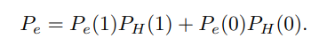
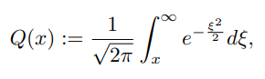

# Cuarta Clase 27/3

*ignorar en formato*

{0,1}
-----[---(+)---]----Y  -> 0 + N
         N = AWGN      -> 1 + N

$P(\hat{H}|y) = \frac{f_{Y|H}(Y|\hat{H})\cdot P_{H}(\hat{H})}{f_Y(y)}$

$P(A|B) = \frac{P(A) \cdot P(B|A)}{P(B)} = \frac{P(AB)}{P(B)}$

$\hat{H} = \underset{H\in (0,1)}{\operatorname{argmax}} P(H|y)$  -  MAP

Hipotesis Equiprobable $\hat{H} = \underset{H\in (0,1)}{\operatorname{argmax}} f(y|H)$   -  ML

**MAP** = cuando se conoce la probabilidad de la fuente.

**ML** = cuando no se conoce la distribucion de la fuente y/o cuando es equiprobable; solo se necesita la funcion de distribucion condicionada.

$\frac{f_{Y|H}(y|1)P_{H}(1)}{}\overset{\hat{H}=1}{\underset{\hat{H}=0}\gtreqless}P_{Y|H}(y|0)$ (...corregir...)

likehood ratio = $Λ(y) = ... =\eta$

**Testeo de hipotesis m-ario**:

$\hat{H}_{MAP}(y)=\underset{i \in \mathcal{H}}{\operatorname{argmax}}f_{Y|H}(y|i)P_{H}(i)$

**Hipotesis binaria (2 gaussianas con media en 0 y en 1)**:
El error es la integral desde 0,5 (valor critico) al resto de la cola de la distribucion:

$\int_{-\infin}^{0.5}f(y|H=1)dy = \int_{0.5}^{\infin}f(y|H=0)dy$

para calcular el error necesitamos el area desde el valor critico multiplicada por la probabilidad de la fuente:

**La funcion Q**: 
se utiliza para calcular el area de una Gaussiana desde un valor x al infinito(???)

Variable aleatoria Gaussiana: $\mathcal{N}(media,varianza)$
