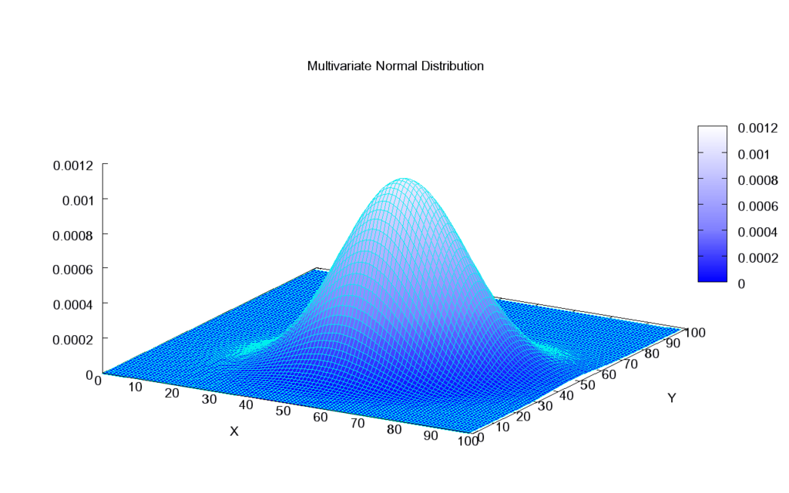
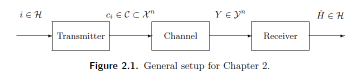
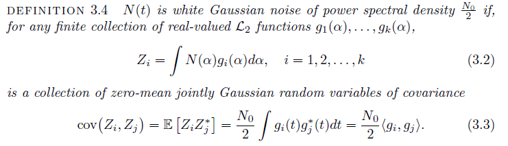

# Quinta Clase 03/04

Repaso leve de Teoria de Señales (mal) -> Ortogonalidad, Bases y nosequemas.

Vector aleatorio Gaussiano. $\mathbb{R}^2 \to \mathbb{R}$

**Multivariate Normal Distribution**:

Terminamos de ver el capitulo 2.

## Capitulo 3

Empezamos a ver el tiempo Continuo.

Ruido Gaussiano Blanco:

$Z(t) = \int N(\alpha)h(t-\alpha)d\alpha \\ Z(t_i) = \int N(\alpha)h(t_i-\alpha)d\alpha$

$Z = [Z_1,Z_2,...,Z_n]$

$E_{[Z]}=[E_{[Z_1]},E_{[Z_2]},...,E_{[Z_n]}] = [0,0,0]$

$\operatorname{cov}(Z_i,Z_j) = \frac{N_0}{2}\langle g_i,g_j \rangle$

$\operatorname{cov}(Z_1,Z_1) = \mathbb{E}[Z_1,Z_1] \\$ con $Z_1 = \int N(\alpha)g_1(\alpha)d\alpha$

$Z_i$ es una observacion, una variable aleatoria.

La covarianza es 2x2, KxK.

K mediciones (?).

$Z_n = Z_1(t_0),Z_2(t_1),...,Z_n(t_n) \\ ... \\ Z_k = Z_k(t_o),Z_k(t_1),...,Z_k(t_n)$

$Z_n,...,Z_k = Z$

Luego: $Z = (Z_1,...,Z_k)^T$

Matriz de Covarianza:

$\begin{bmatrix}
    \operatorname{cov}(Z_1,Z_1) & \operatorname{cov}(Z_1,Z_2)\\
    \operatorname{cov}(Z_2,Z_1) & \operatorname{cov}(Z_2,Z_2)
\end{bmatrix} = \begin{bmatrix}
    \sigma_1^2=N_0/2 & \phi\\
    \phi & \sigma_2^2=N_0/2
\end{bmatrix}^{= \frac{N_0}{2}\lang \rho_i(t),\rho_i(t) \rang}$

Arquitectura del Transmisor-Receptor:

NOTA:

    La varianza de una señal aleatoria es la potencia de la señal, y la podemos utilizar para normalizar la señal recibida.
