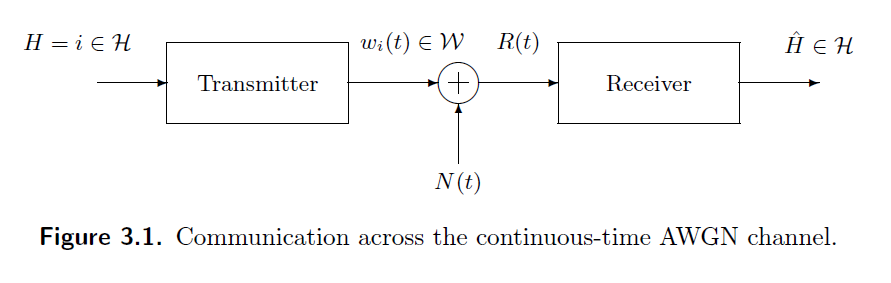
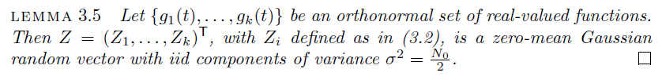
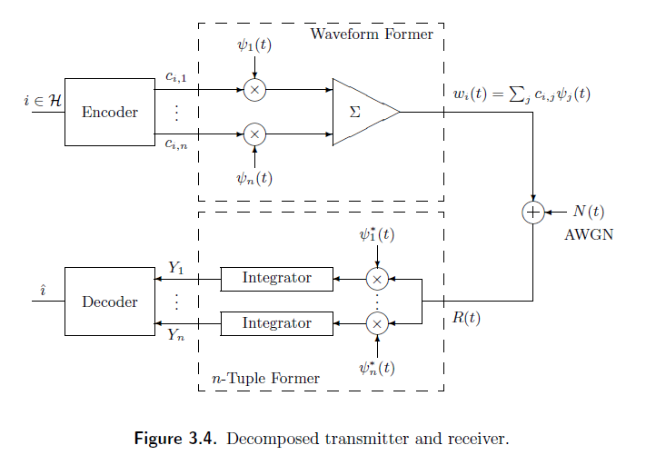
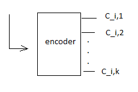
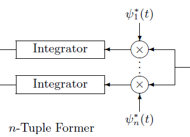
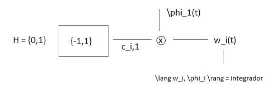

# Sexta Clase 10/04

## Teórico

$N(t) \rightarrow N(t_0), N(t_1),...,N(t_n)$ son variables Aleatorias

Funciones de distribuciones de variables aleatorias: $f_{Nfi;Nfj} \quad \mathbb{R^2} \rightarrow \mathbb{R}$

Se tiene que lograr que las variables aleatorias no dependan de las otras (sean independientes).

*Cuando la matriz de covarianza es la matriz de identidad el proceso es independiente*.

Nos vamos a mover en el dominio de las variables Gaussianas.

*Si tengo un vector no gaussiano con covarianza identidad NO puedo asegurar independencia*.

En este caso el receptor es un filtro, y el filtro está formado por funciones ortogonales.

La base debe ser ORTONORMAL.

Las componentes de la Covarianza: $\frac{N_0}{2}\lang g_i,g_j\rang$, siendo $g_i$ y $g_j$ funciones de la base. (considerando una base ortonormal)

$\operatorname{cov}^{\mathbb{n}\times\mathbb{n}} = \begin{bmatrix} ... \end{bmatrix}$

Nos vamos al transmisor y receptor descompuesto en partes:

$H_i \rightarrow w_i(t) = \sum_{k=1}^{n}c_k \cdot \psi_k(t)$

Los coeficientes $c_k$ los da el encoder.

Una waveform particular, llevará una combinacion de coeficientes, una combinacion lineal de vectores en una base ortonormal *(para eso usamos los coeficientes)*.

$H_i \rightarrow w_i(t) = \sum_{k=1}^{n}c_{i,k} \cdot \psi_k(t)$

Estamos con la señal, ruido $R(t)=0$, la proyecto sobre la base usando el integrador. Esto es $\int{w_i(t) \psi_1(t)dt} = c_{i,1}$ (usamos $w_i(t)$ porque tomamod al ruido como nulo)

*(aclaración: no es phi es psi)*

En este caso $c_{i,1}$ ya se considera en tiempo discreto.

Dos Waveform - Hipotesis Binaria:

$H \in \{0,1\} \rightarrow [encoder = seno y coseno = \psi_1(t),\psi_2(t)] \rightarrow \{(1,0),(0,1)\}$

$c_{i,1} \times \psi_1(t) \searrow \\ \qquad \qquad \qquad\sum \rightarrow w_i(t) \\ c_{i,2} \times \psi_2(t) \nearrow$

Cuatro Waveform - Hipotesis 4:

$H \in \{0,1,2,3\} \rightarrow
\begin{bmatrix}
    (0,0) & (0,1) \\
    (1,0) & (1,1)
\end{bmatrix}$

$c_{i,1} \times \psi_1(t) \searrow \\ \qquad \qquad \qquad\sum \rightarrow w_i(t) \\ c_{i,2} \times \psi_2(t) \nearrow$

$ \qquad \quad \times \psi_1(t) \rightarrow c_{i,1}\\ w_i(t)^{\nearrow}_{\searrow} \\ \qquad \quad \times \psi_2(t) \rightarrow c_{i,2}$

Ahora, al tener ruido y proyectarlo sobre la base ortonormal, obtengo 2 componentes de ruido. Por ende ahora:

$ \rightarrow c_{i,1} + z_1 = Y_{i,1} \\ \rightarrow c_{i,2} + z_2 = Y_{i,2}$

$\operatorname{cov}(z_i,z_j) = \lang Z_i, Z_j \rang = \frac{N_0}{2} \lang \psi_i,\psi_j \rang \rightarrow ...$

$ ... \rightarrow \begin{bmatrix} \operatorname{cov}(z_1,z_1) & \operatorname{cov}(z_1,z_2) \\ \operatorname{cov}(z_2,z_1) & \operatorname{cov}(z_2,z_2)\end{bmatrix} = \begin{bmatrix} \frac{N_0}{2} & 0 \\ 0 & \frac{N_0}{2} \end{bmatrix}$

## Práctico

Lo que se hace en el encoder es la sumatoria de vectores (o señales) multiplicados por una constante, por ende es la combinacion lineal de vectores.

Si las funciones $\psi$ son ortonormales, el ruido recibido por el receptor seguirá siendo ruido gaussiano con valor $\frac{N_0}{2}$.
